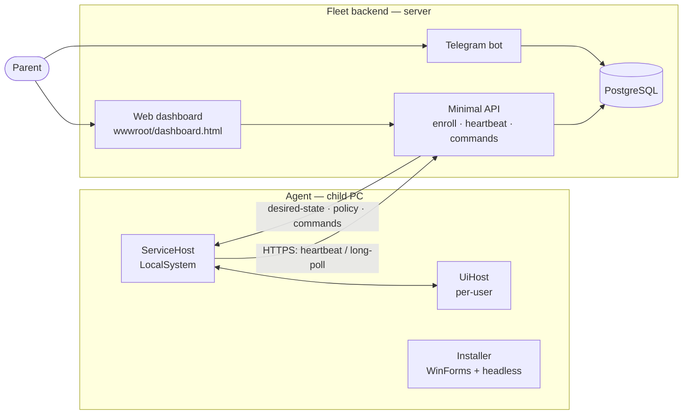
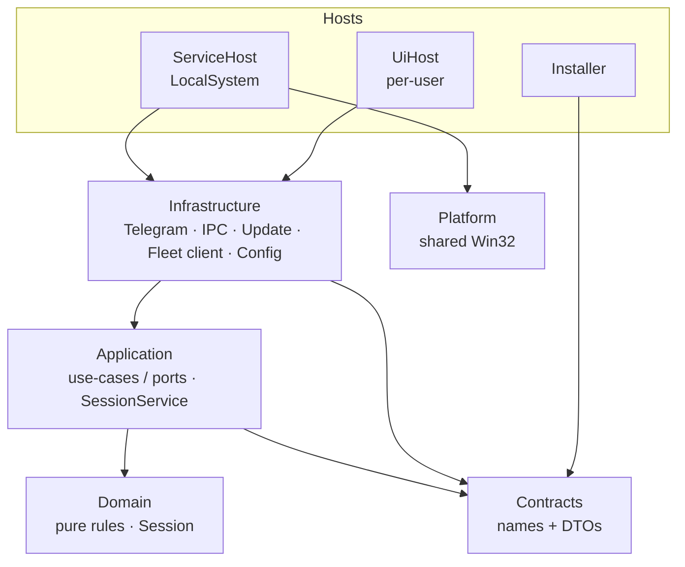

# Architecture

How KidControl is put together, end to end: the managed Windows **agent**, the fleet
**backend** (API + Telegram bot + web dashboard), and the trust boundaries between them.
For product usage read [README.md](README.md); for the threat model read
[SECURITY.md](SECURITY.md).

## The two halves

The agent enforces locally and is authoritative for *its* timer; the backend is the
control plane the parent drives. They are decoupled — the agent keeps enforcing even if
the backend is unreachable, and reconciles when it comes back.

## Agent layers

| Layer | May depend on | Must NOT depend on |
| --- | --- | --- |
| **Domain** | (nothing) | everything else |
| **Contracts** / **Fleet.Contracts** | (nothing) | everything else |
| **Application** | Domain, Contracts | Infrastructure, Platform, hosts |
| **Infrastructure** | Application, Contracts, Platform | hosts, Installer |
| **Platform** | Contracts | Application, Infrastructure, hosts |
| **Hosts** | everything below | each other |
| **Installer.Core** | **Contracts only** | Infrastructure, WinForms, hosts |
| **Installer** | Installer.Core, Contracts | Infrastructure, hosts |

Two rules do the heavy lifting: **Infrastructure implements Application's ports** (the
use-case boundary; the hosts' DI container wires Telegram/IPC/update/fleet/config
implementations to Application's interfaces), and **Installer.Core references only
Contracts** — it re-derives its paths from `KidControlNames` (`InstallLocations`) instead
of taking a dependency on Infrastructure's `AppPaths`, so the installer stays buildable
and testable without dragging in the runtime stack.

## The interval engine (domain)

The heart of enforcement is a **clock-free** domain type, `KidControl.Domain.Session`,
orchestrated by `KidControl.Application.SessionService` against an injected `IClock` and
persisted through `ISessionStore` (`session_state.json`). Keeping it clock-free makes the
whole engine unit-testable offline.

- **Play/rest intervals.** A rule is "play N / rest M". When play runs out the session
  enters `Resting`; when the rest elapses it returns to a fresh `Playing`.
- **Off-time accounting.** Time that passes while the PC is off or asleep counts only
  against a **break** — play is never consumed while the machine isn't in use
  (`Session.ApplyOfflineRest`). Shutting down mid-play preserves the remaining play;
  shutting down mid-break lets the break elapse in the background, and the next boot
  starts play once the break is over.
- **Night boundary.** Crossing the night window's *end* starts a fresh play phase (a new
  day) — `SessionService.CrossedNightEnd`, which keys off the end time so it works across
  midnight. Online, the per-second tick is unchanged; a gap over two minutes
  (`MaxTickJump`) is treated as a suspend/resume, not a live tick.

## IPC model — named pipes + ACLs

The service and the per-user UI live in different sessions and trust levels, so they talk
over named pipes whose ACLs encode the boundary (`KidControlNames`):

| Pipe | Direction | Purpose | Access control |
| --- | --- | --- | --- |
| `KidControl.State` | service → UI | broadcasts session state (time left, status) | readable by interactive users |
| `KidControl.Command` | privileged tool → service | emergency commands | **Administrators only** |
| `KidControl.UiCommand` | service → UI | screenshot / audio requests | per-user UI |

The command pipe is the sensitive one: only an Administrator-authenticated client may
connect, and the line protocol (`CommandPipeProtocol`) is tiny and explicit —
`INITIATE_EMERGENCY_AUTH`, `EMERGENCY_SHUTDOWN:<otp>`, with `OK` / `DENIED` /
`RATE_LIMITED` / `BAD_REQUEST` responses. The state pipe carries no secrets.

## Fleet protocol (agent ↔ backend)

The agent is a managed node; the backend is the control plane.

- **Enroll.** The agent posts an enroll code and receives a bearer token; the backend
  stores a hash (`Device.TokenHash`).
- **Heartbeat.** The agent periodically posts a `StatusReportDto` (status, time left,
  agent version, last night-attempt). The backend records liveness + status, accumulates
  active use into `device_usage_daily` (only while `Playing`, gaps over 3 min ignored,
  Tashkent day boundary), and alerts on night attempts.
- **Desired-state + policy.** Each heartbeat carries the agent's known policy/desired
  versions; the backend returns a fresh snapshot only when the agent is stale
  (paused, force-blocked, target version, play/rest/night rules).
- **Commands.** Long-poll delivers one-shot commands (add time, screenshot, play audio,
  set target version) with a TTL; the agent applies them via `FleetCommandApplier` and
  reports back.

The backend is an ASP.NET Core **minimal API** with **EF Core 8 + Npgsql**
(`EFCore.NamingConventions` → snake_case); migrations are applied on startup
(`FleetSeed.MigrateAndSeedAsync`, gated by `Fleet:AutoMigrate`). The **Telegram bot**
long-polls inside the same process; the **web dashboard** is a self-contained
`wwwroot/dashboard.html` served over the `/admin/*` REST API, gated by an `X-Admin-Key`
header (`FLEET_ADMIN_API_KEY`).

## Update trust model

The self-update path runs inside the LocalSystem service, so a compromised update is a
SYSTEM RCE. The chain:

1. **Fixed source.** `UpdateConfig.Owner` / `Repository` are set at deploy time in the
   protected `appsettings.json`, never from an attacker-writable location; downloads are
   restricted to `AllowedAssetHosts`.
2. **Signature gate.** With `RequireSignature = true`, a downloaded installer must carry a
   valid Authenticode signature whose thumbprint matches `TrustedThumbprint` before it
   runs. (Releases are currently **unsigned** — see [SECURITY.md](SECURITY.md) — so
   production installs set this per deployment.)
3. **Apply detached, crash-safe.** The verified payload is handed to a one-shot **SYSTEM
   scheduled task** (`ScheduledTaskUpdateLauncher` → `KidControl.Installer.exe
   /apply-update`), so the swap runs *outside* the service's process tree. This is the fix
   for the v2.1 brick, where the installer ran as a child of the very service it stopped —
   and `sc delete`-d — so a mid-swap kill left no service at all. `InstallOrchestrator.Update`
   now: stop (**never** delete) → back up current binaries → copy → start → health-check
   (`ServiceInstaller.WaitUntilHealthy`: Running + an 8 s stability window) → **roll back**
   on any failure. SCM failure-recovery is the final backstop. With this in place
   `UpdateConfig.AutoInstall` defaults **on**.

The release workflow publishes `SHA256SUMS.txt`; when signing secrets are present it also
signs the executables and the runtime enforces the signature.

## State persistence & restart recovery

- **State store.** The authoritative timer is `session_state.json` under the ACL-protected
  `%ProgramData%\KidControl` tree (`AppPaths.StateFile`). Writes are atomic
  (write-temp-then-replace) so a crash mid-write cannot corrupt the timer or grant free time.
- **Config override.** The host loads its shipped `appsettings.json`, then overlays the
  protected ProgramData copy (`AppPaths.OverrideConfigFile`, `optional: true`), so the
  child cannot disable protection by deleting a file the service boots without. This
  override survives binary-only `/update` (which doesn't recopy the baked appsettings).
- **Service recovery.** The service is registered with SCM failure actions
  (`restart/1000` ×3). `ProtectionConfig.CriticalProcess` (opt-in) marks the process
  critical; `ProcessProtection.RunCriticalAsync` clears the flag in a `finally` so an
  unhandled fault can't leave the machine un-shutdownable. A UI watchdog can trigger a
  SYSTEM scheduled task to restart the service, closing the gap before SCM's own restart.
- **Recovery on boot.** On start the service reloads `session_state.json`; if absent it
  seeds a default session. Because state lives in protected ProgramData and survives
  updates, a reboot or update resumes the child's remaining time.

## Releases & CI

- **CI** (`.github/workflows/ci.yml`) — build + tests with coverage on every push and PR.
- **Release** (`.github/workflows/release.yml`) — fires on a `vX.Y.Z` tag on
  windows-latest: runs tests, MinVer stamps the version from the tag, signs if
  `CODE_SIGNING_PFX_BASE64` is set, and publishes a GitHub Release with the setup zip,
  the payload EXEs and `SHA256SUMS.txt`. The agent auto-updates from there.

Agent projects target `net8.0-windows` (Win32/WinForms — Windows-only build); the
backend, Application, Domain, Contracts and Infrastructure target `net8.0` and build/test
on any platform. See [CONTRIBUTING.md](CONTRIBUTING.md).
