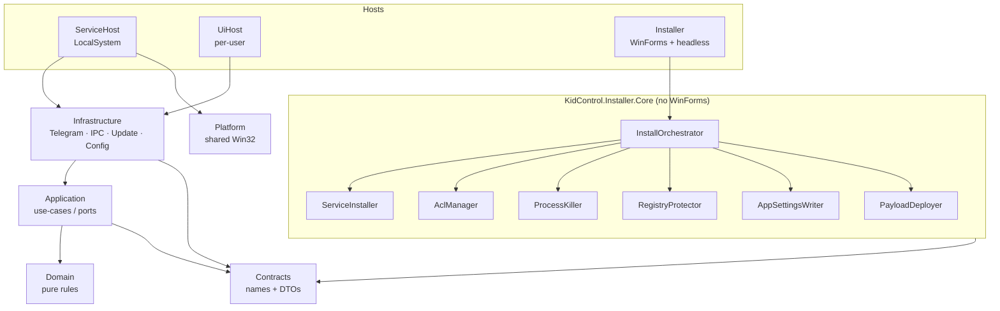

# Architecture

> Reference implementation — not yet compiled. See [README.md](README.md).

## Layers

## Dependency rules

| Layer | May depend on | Must NOT depend on |
| --- | --- | --- |
| **Domain** | (nothing) | everything else |
| **Contracts** | (nothing) | everything else |
| **Application** | Domain, Contracts | Infrastructure, Platform, hosts |
| **Infrastructure** | Application, Contracts, Platform | hosts, Installer |
| **Platform** | Contracts | Application, Infrastructure, hosts |
| **Hosts** | everything below | each other |
| **Installer.Core** | **Contracts only** | Infrastructure, WinForms, hosts |
| **Installer** | Installer.Core, Contracts | Infrastructure, hosts |

Two rules do the heavy lifting:

1. **Infrastructure implements Application's ports.** Application declares interfaces
   (the use-case boundary); Infrastructure provides Telegram/IPC/update/config
   implementations, wired by the hosts' DI container.
2. **Installer.Core references only Contracts.** It re-derives its paths from
   `KidControlNames` (`InstallLocations`) rather than taking a dependency on
   Infrastructure's `AppPaths`. That keeps the installer buildable and testable
   without dragging in the runtime stack.

## IPC model — named pipes + ACLs

The service and the per-user UI live in different sessions and different trust levels,
so they talk over named pipes whose ACLs encode the trust boundary
(`KidControlNames`):

| Pipe | Direction | Purpose | Access control |
| --- | --- | --- | --- |
| `KidControl.State` | service → UI | broadcasts session state (time left, status) | readable by interactive users |
| `KidControl.Command` | privileged tool → service | emergency commands | **Administrators only** |
| `KidControl.UiCommand` | service → UI | screenshot requests | per-user UI |

The command pipe is the sensitive one: only an Administrator-authenticated client may
connect, and the line protocol (`CommandPipeProtocol`) is tiny and explicit —
`INITIATE_EMERGENCY_AUTH`, `EMERGENCY_SHUTDOWN:<otp>`, with `OK` / `DENIED` /
`RATE_LIMITED` / `BAD_REQUEST` responses. The state pipe carries no secrets, so a child
reading it learns only how much time is left.

## Update trust model

The self-update path (`UpdateBackgroundService` in Infrastructure, governed by
`UpdateConfig`) runs inside the LocalSystem service, so a compromised update is a SYSTEM
RCE. The chain is:

1. **Fixed source.** `UpdateConfig.Owner` / `Repository` are set at deploy time in the
   protected `appsettings.json`, never from an attacker-writable location. Asset
   downloads are restricted to `AllowedAssetHosts`.
2. **Signature gate.** With `RequireSignature = true` (the default), a downloaded
   installer must carry a valid Authenticode signature whose certificate thumbprint
   matches `TrustedThumbprint` before it is executed.
3. **Apply headlessly.** The verified installer is invoked with `/update`, which runs
   `InstallOrchestrator.Update` — binaries only, config and state preserved — with no
   Form and no window.

The release workflow signs the executables and publishes `SHA256SUMS.txt`; the runtime
enforces the signature. Both halves are required — see [SECURITY.md](SECURITY.md).

## State persistence & restart recovery

- **State store.** The authoritative timer state is `session_state.json` under the
  protected `%ProgramData%\KidControl` tree (`AppPaths.StateFile`). Writes are atomic
  (write-temp-then-replace) so a crash mid-write cannot corrupt the timer or hand the
  child extra time.
- **Config override.** The host loads its shipped `appsettings.json` and then overlays
  the protected copy in ProgramData (`AppPaths.OverrideConfigFile`, `optional: true`),
  so the child cannot disable protection by deleting a file the service can boot without.
- **Service recovery.** The service is registered with SCM failure actions
  (`restart/1000` ×3) so the SCM restarts it after a crash. `ProtectionConfig.CriticalProcess`
  (opt-in) additionally marks the process critical; `ProcessProtection.RunCriticalAsync`
  clears the critical flag in a `finally` block so an unhandled fault can never leave the
  machine un-shutdownable.
- **Watchdog.** The UI's service-watchdog can trigger a SYSTEM scheduled task to restart
  the service if the process disappears, closing the gap between a kill and the SCM's
  restart.
- **Recovery on boot.** On start the service reloads `session_state.json`; if absent
  (first install) it seeds a default session. Because state lives in protected
  ProgramData and survives updates, a reboot or update resumes the child's remaining time
  rather than resetting it.
