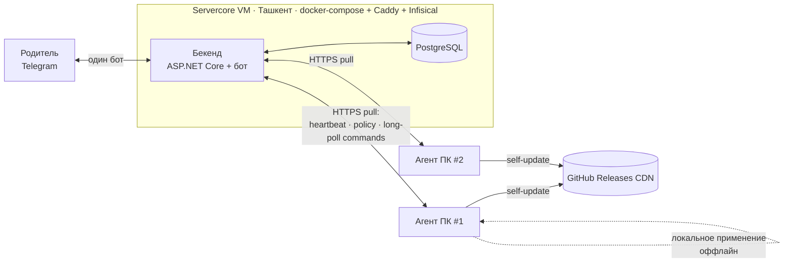

# RFC-01 — Флот устройств: бекенд + агенты (offline-first)

Статус: **принят к реализации** (согласовано в grilling-сессии).
Область: превратить standalone-установки KidControl в управляемый **флот**: центральный
бекенд + агенты на машинах, с раздельными политиками по устройствам и обязательной
работой агента при недоступности бекенда.

---

## 1. Контекст и цель

Сейчас каждый ПК — самостоятельная установка: служба (`ServiceHost`) + WPF-UI +
**встроенный в службу Telegram-бот**, конфиг/состояние/админы — локальные JSON в
`%ProgramData%\KidControl`, обновления — GitHub Releases. Несколько машин = несколько
ботов/чатов, нет единого управления.

**Цель:** одно место управления несколькими устройствами с **раздельными политиками**,
при этом агент **продолжает применять политику локально даже при недоступности бекенда**.

### Не-цели (сейчас)
- Мультиарендность/SaaS (много семей, регистрация, биллинг).
- Смена модели времени на «дневной бюджет» (оставляем цикл игра/отдых).
- Веб-дашборд, медиа-реле (скриншот/аудио), история/аудит-UI, алерты — это Phase 2–3.

---

## 2. Ключевые решения (итоги grilling)

| # | Решение | Выбор |
|---|---------|-------|
| 1 | Масштаб | Одна семья (N устройств). Зарезервировать `tenant_id`, не строить мультиарендность. |
| 2 | Плоскость управления | **Один Telegram-бот внутри бекенда** ↔ бекенд ↔ агенты. Агент теряет свой бот. |
| 3 | К чему привязана политика | **К устройству** (+ опциональная группа-метка для массового применения). Без общего бюджета. |
| 4 | Транспорт | **Агент тянёт по HTTPS**: heartbeat/статус + **long-poll** для команд (~1–2с). Проходит NAT. |
| 5 | Офлайн | Локальное применение всегда; команды **в очереди с TTL** до реконнекта; локальный **OTP** для аварии. |
| 6 | Аутентификация агента | `/enroll` → одноразовый код → **пер-девайсный токен** (отзываемый). Оператор = Telegram-whitelist. |
| 7 | Смена политики после офлайна | **Сброс текущей фазы сразу** (как `/setrule`). |
| 8 | Стек/хостинг | **ASP.NET Core (.NET 8) + PostgreSQL + EF Core**, docker-compose+Caddy+Infisical на VM (Ташкент). Общая .NET-домен-библиотека с агентом. |
| 9 | Миграция | **Один агент, два режима**: standalone (по умолчанию) / managed (когда задан `Backend:Url`). Откат — очистить URL. |
| 10 | State vs Command | Оверрайды (пауза/блок/ночь/интервалы/правило/целевая версия) = **синхронизируемое состояние**; действия (+время/сброс/выключение/…​) = **одноразовые команды** с TTL. |
| 11 | Первый милстоун | **Полный Phase 1** (внутренне — скелет-первым). |
| 12 | Выбор устройства в боте | **Список устройств → меню, привязанное к устройству** + обзор «все устройства». |
| 13 | Обновления | **Гибрид**: бинарники на GitHub CDN, **бекенд назначает целевую версию/канал** на устройство. |

---

## 3. Архитектура



**Разделение источников правды:**
- **Бекенд — владелец политики** (версионируется; агент кэширует и применяет офлайн).
- **Агент — владелец живого состояния сессии** (таймер/статус; шлёт наверх на heartbeat).
- Бекенд хранит: желаемое состояние, очередь команд, последний отчёт статуса, аудит-лог
  изменений (без централизованного учёта времени — политика пер-девайсная).

---

## 4. Модель данных (PostgreSQL / EF Core)

```
tenant           (id, name)                          -- зарезервировано, 1 строка
admin            (id, tenant_id, telegram_chat_id)   -- центральный AdminRegistry
device           (id, tenant_id, name, group_label,
                  enrolled_at, last_seen_at, agent_version, os_info, token_hash, revoked)
device_policy    (device_id, version, rule_play_min, rule_rest_min,
                  night_enabled, night_start, night_end, intervals_enabled,
                  target_version, updated_at)         -- ЖЕЛАЕМАЯ политика (декларатив)
device_desired   (device_id, paused, force_blocked, night_bypass_until, version)
                                                      -- долгоживущие оверрайды-состояние
device_status    (device_id, status, time_remaining, is_night, is_unlimited,
                  shutdown_in_sec, reported_at)       -- последний отчёт агента (для показа)
command          (id, device_id, type, payload_json, ttl_at, created_at,
                  delivered_at, acked_at, result)     -- одноразовые команды
enroll_code      (code, tenant_id, expires_at, used_by_device_id)
audit            (id, tenant_id, actor, action, device_id, detail_json, at)
```

`policy` и `desired` версионируются (монотонный `version` на устройство) — агент шлёт
свою известную версию, бекенд отвечает дельтой/полным снимком, если версия отстала.

---

## 5. API

### 5.1 Агентские эндпоинты (Bearer per-device token)
- `POST /agent/enroll` — тело `{ code, machineName, osInfo }` → `{ deviceId, token }`.
- `POST /agent/heartbeat` — тело `{ statusReport, policyVersion, desiredVersion }`
  → `{ policy?, desired?, hasCommands }` (снимок, если версия отстала).
- `GET  /agent/commands?wait=50` — **long-poll**; возвращает `[{id,type,payload,ttlAt}]`
  либо пусто по таймауту.
- `POST /agent/commands/ack` — `{ ids:[…], results:{…} }` (at-most-once, идемпотентно).
- `POST /agent/media` — Phase 2 (загрузка скриншота).

### 5.2 Управление (изнутри бота; позже — веб-API)
- Список устройств, статус устройства, редактирование политики (правило, ночь,
  интервалы, целевая версия), установка оверрайдов (пауза/блок), постановка команд
  (+время/сброс/выключение/перезагрузка/update-now), генерация `/enroll`-кода,
  отзыв устройства, управление админами.

Аутентификация оператора — Telegram admin-whitelist (центральный `AdminRegistry`).

---

## 6. Политика vs Команды

**Синхронизируемое состояние (декларатив, версионируется, кэшируется, реконсилится):**
`rule(play/rest)`, `night_enabled`, `night window`, `intervals_enabled`, `target_version`,
и оверрайды `paused`, `force_blocked`, `night_bypass_until`.

**Одноразовые команды (императив, TTL, at-most-once, ack):**
`add_time(min)`, `reset_timer`, `shutdown`, `restart`, `update_now`,
(Phase 2: `screenshot`, `play_audio`).

**Реконсиляция на реконнекте:** агент применяет новейшую политику (правило → сброс фазы
сразу), приводит локальные оверрайды к `desired`, затем сливает очередь команд по порядку,
отбрасывая протухшие по TTL, и подтверждает выполненные.

---

## 7. Офлайн-гарантии
- Политика и desired **durable-кэшируются** локально (переживают перезагрузку) — агент
  применяет их без сети.
- Команды, выданные пока устройство недоступно, ждут в очереди бекенда с **TTL**
  (напр. +время/разблок — 5 мин); протухшие не применяются.
- Идемпотентность по `command.id` + ack → без двойного применения.
- Аварийный доступ на самой машине — существующий **OTP/Unlock** (локально).
- Недоступность **бекенда** (а не устройства) — это простой сервера; агент продолжает
  применять последнюю политику. Восстановление сервера — операционная задача.

---

## 8. Миграция (dual-mode агент)
- `Backend:Url` **не задан** → текущий standalone (встроенный бот, локальный JSON).
- `Backend:Url` задан + устройство enrolled → **managed**: встроенный бот выключен, агент
  тянет политику/команды, шлёт heartbeat.
- Вся локальная логика применения (таймер, ночь, блок, выключение) **идентична** в обоих
  режимах — меняется только источник политики/команд.
- Откат: очистить `Backend:Url` → агент возвращается в standalone.

---

## 9. Обновления (гибрид)
- Бинарники — по-прежнему **GitHub Releases** (CDN, без лимитов API).
- `target_version`/`channel` — **поле политики на устройство**: в managed-режиме агент
  берёт целевую версию с бекенда (`latest` или пин `vX.Y.Z`) и качает с GitHub; в
  standalone — как сейчас (`latest`). Доставка апдейтов **не зависит** от аптайма бекенда.

---

## 10. Phase 1 — разбивка на задачи

Порядок — **скелет-первым**: сначала сквозной цикл на одном устройстве, потом ширина.
Каждая задача — с критерием готовности (`DoD`).

### Блок A. Контракты и бекенд-скелет
- [x] **T1. Общая библиотека контрактов.** ✅ Проект `KidControl.Fleet.Contracts` (net8.0,
      ссылка только на `KidControl.Domain`): `PolicyDto` (версионируемая, с маппингом на
      `ScheduleRule`/`NightWindow`), `DesiredStateDto`, `CommandDto`+`CommandTypes`+ack,
      `EnrollRequest/Response`, `HeartbeatRequest/Response`, `StatusReportDto`, `FleetJson`
      (толерантная сериализация). 7 тестов (round-trip, толерантность к неизвестным/
      отсутствующим полям, маппинг в домен, payload-хелперы/TTL). *DoD выполнен;* ссылки
      из агента/бекенда добавятся в T2/T5, когда появятся эти проекты.
- [x] **T2. Скелет бекенда.** ✅ Проект `KidControl.Backend` (ASP.NET Core, ссылается на
      `Fleet.Contracts`+`Domain`), EF Core + Npgsql, пустой `FleetDbContext` (сущности — T3),
      health-эндпоинты `/health` (liveness) и `/health/db` (readiness через
      `CanConnectAsync`). `deploy/`: `docker-compose.yml` (postgres+backend+опц. Caddy),
      `Caddyfile`, `.env.template`; `Dockerfile` (multi-stage). *DoD выполнен:* собирается,
      локально запускается, `GET /health` = 200, `/health/db` = 503 без БД (грациозно).
- [x] **T3. Модель данных + миграции.** Сущности §4, первая EF-миграция.
      *DoD:* `dotnet ef database update` создаёт схему; сид одного `tenant`+`admin`.
      *Готово:* 9 сущностей + `FleetDbContext` (snake_case, jsonb, индексы), миграция
      `InitialFleetSchema` (10 таблиц), `tenant` сеется в миграции, `admin` — рантайм-сидер
      `FleetSeed` из `FLEET_ADMIN_CHAT_ID`. Проверено на Postgres 16: `database update`
      создаёт схему, boot с пустой БД мигрирует и сеет `tenant`+`admin`.

### Блок B. Сквозной скелет (1 устройство)
- [x] **T4. Enrollment.** Генерация одноразового кода (сервис + позже кнопка/команда бота),
      `POST /agent/enroll` → пер-девайсный токен (хэш в БД), Bearer-middleware.
      *DoD:* по коду создаётся `device`, выдаётся токен; повторный код невалиден.
      *Готово:* `FleetTokens` (код base32 без похожих символов, токен 256-бит base64url,
      SHA-256-хэш), `EnrollmentService` (mint кода с TTL, single-use в serializable-tx,
      дефолтные policy/desired, аудит), Bearer-схема `DeviceToken`. Эндпоинты
      `POST /agent/enroll`, `GET /agent/whoami` (protected), `POST /admin/enroll-code`
      (временный, под `FLEET_ADMIN_API_KEY`, до бота из T11). 9 unit-тестов (InMemory) +
      e2e на Postgres 16: mint→enroll→whoami→повтор=409→неизвестный=404→плохой токен=401;
      токен хранится только хэшем.
- [x] **T5. Dual-mode агент + enrollment-клиент.** Переключатель по `Backend:Url`,
      хранение токена в защищённом `%ProgramData%`, выключение встроенного бота в managed.
      *DoD:* агент с заданным URL проходит enroll и хранит токен; без URL — как сейчас.
      *Готово:* секция конфига `Fleet` (`Url`/`EnrollCode`/интервалы), `FleetClient`
      (typed HttpClient, `EnrollAsync` на общем `FleetJson`), `FleetEnrollmentService`
      (идемпотентный enroll-if-needed, офлайн-устойчивый), `DpapiDeviceIdentityStore`
      (токен зашифрован DPAPI machine-scope в `%ProgramData%\KidControl\device_identity.dat`,
      atomic write, никогда не логируется), `FleetEnrollmentHostedService`. В `Program.cs`
      переключатель: `Fleet:Url` задан → managed (встроенный бот выключен, включён
      fleet-enrollment); пусто → standalone как раньше. Локальное применение (Worker,
      CommandPipe, Update) одинаково в обоих режимах. 7 unit-тестов (managed/standalone,
      enroll+persist, already-enrolled skip, no-code, 409, бекенд недоступен → non-fatal).
- [x] **T6. Heartbeat + синхронизация политики.** `POST /agent/heartbeat` (статус вверх,
      политика/desired вниз при отставании версии), durable-кэш политики у агента,
      применение (правило → сброс фазы сразу). *DoD:* меняю правило на бекенде → в течение
      heartbeat агент применил; после перезагрузки агента политика из кэша.
      *Готово:* бекенд — `HeartbeatService` (upsert `device_status`+liveness, delta-снимок
      политики/desired по версии, `hasCommands`), `DeviceAdminService` (правка политики с
      bump версии, список устройств), эндпоинты `POST /agent/heartbeat` (protected),
      `GET /admin/devices`, `POST /admin/devices/{id}/policy`. Агент — `FleetState`+
      `JsonFleetStateStore` (durable-кэш политики/desired в `%ProgramData%`),
      `FleetPolicyApplier` (PolicyDto → те же `SessionCommand`, правило последним = сброс
      фазы), `FleetClient.HeartbeatAsync`, `FleetHeartbeatHostedService` (на старте
      применяет кэш → enroll → цикл heartbeat; бекенд недоступен → остаётся на кэше).
      6 бекенд-тестов + 2 агентских; e2e на Postgres: правка политики → следующий heartbeat
      отдаёт новую версию, актуальный агент — `null`. Применение desired (пауза/блок) — T7.
- [x] **T7. Long-poll команды (скелет: `add_time` + `pause`).** `GET /agent/commands`
      (long-poll) + `POST /ack`; desired-оверрайд `paused`. *DoD:* из бота ставлю паузу →
      устройство на паузе (state) и это видно централизованно; `+30 мин` применяется один
      раз, повтор по ack не дублируется; протухшая по TTL команда игнорируется.
      *Готово:* бекенд — `CommandService` (enqueue/long-poll с `CommandSignal`-пробуждением/
      ack, at-least-once доставка, TTL-фильтр), `DeviceAdminService.SetPausedAsync`
      (desired-оверрайд, bump версии, идемпотентно), эндпоинты `GET /agent/commands?wait=`,
      `POST /agent/commands/ack`, `POST /admin/devices/{id}/pause`,
      `POST /admin/devices/{id}/commands`. Агент — `FleetCommandApplier` (add_time/reset_timer),
      `JsonProcessedCommandStore` (dedupe apply-once, durable, bounded), `FleetCommandHostedService`
      (long-poll → dedupe → apply → ack), `FleetDesiredApplier` (пауза/resume, идемпотентно) в
      heartbeat-лупе. 7 бекенд-тестов + 4 агентских. E2e на Postgres: пауза видна централизованно;
      add_time повторно доставляется до ack, но применяется один раз; протухшая по TTL —
      игнорируется; long-poll просыпается за ~1с. Force-block + night-bypass — T9.
- [x] **T8. Офлайн-реконсиляция + тесты.** Отключение сети: агент применяет кэш; команды
      копятся; на реконнекте — политика → desired → очередь (TTL, идемпотентность).
      *DoD:* интеграционные тесты сценариев офлайн/реконнект зелёные.
      *Готово:* реконсиляция вынесена в тестируемый `FleetReconciler` за интерфейсом
      `IFleetClient` — один цикл: heartbeat (политика **→** desired) **→** слив очереди команд
      (TTL-фильтр, dedupe apply-once, ack). Два лупа объединены в единый `FleetAgentHostedService`
      (кэш на старте → enroll → цикл), что гарантирует порядок. 6 интеграционных тестов
      (реальные `SessionService`+апплаеры+in-memory кэши, фейковый бекенд): офлайн-старт
      применяет кэш без сети; реконнект реконсилит политику→desired→команды строго по порядку;
      команда повторно доставляется, но применяется один раз; протухшая по TTL игнорируется;
      команды, накопленные офлайн, сливаются по порядку; пауза из кэша переживает рестарт.
      Все 31 тест Infrastructure зелёные.

### Блок C. Ширина (весь Phase 1)
- [ ] **T9. Полный набор desired-состояния.** `force_blocked`, `night_enabled`+окно,
      `intervals_enabled`, `target_version`. *DoD:* каждое меняется с бекенда и
      реконсилится; целевая версия управляет self-update (гибрид §9).
- [ ] **T10. Полный набор команд (без медиа).** `reset_timer`, `shutdown`, `restart`,
      `update_now`. *DoD:* каждая исполняется на агенте с ack; медиа-кнопки в managed
      помечены «Phase 2».
- [ ] **T11. Бот в бекенде: устройства + меню.** Long-poll бота внутри бекенда; верхний
      уровень — список устройств; выбор → текущее меню (📊/➕/🎮/💻/⚙️/🌙/📦/👤), привязанное
      к устройству; обзор «Все устройства»; команды `/enroll`, отзыв устройства, админы.
      *DoD:* весь существующий UX работает на выбранном устройстве через бекенд.

### Блок D. Выпуск
- [ ] **T12. Деплой на VM.** docker-compose + Caddy (TLS) + Infisical на VM; смоук:
      enroll реального агента, смена политики, команда, офлайн-тест. *DoD:* бекенд доступен
      по HTTPS, один реальный ПК управляется из бота.
- [ ] **T13. Документация и гайд миграции.** README бекенда, схема enroll, как перевести
      существующий standalone в managed и обратно; обновить `deploy.bat`/`update.bat`
      (опции `KC_BACKEND_URL`/enroll). *DoD:* по гайду можно поднять бекенд и подключить агент.

**Порядок:** A → B (T4–T8 — критический скелет и офлайн) → C → D.

---

## 11. Открытые параметры (тюнинг, не блокеры)
- Интервалы heartbeat/long-poll (старт: heartbeat 30–60с, long-poll wait 50с).
- TTL по типам команд (старт: `add_time`/`unblock`-подобные — 5 мин; `shutdown` — 2 мин).
- Ретенция `device_status`/`audit`.

## 12. Отложено (Phase 2–3)
- Медиа-реле (скриншот-аплоад, аудио) через бекенд.
- Веб-дашборд на том же API; аудит/история UI; алерты (офлайн, ночные попытки).
- Staged/targeted rollout поверх гибридных обновлений.
- Мультиарендность.
